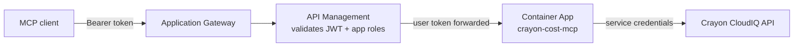

# Crayon Cost MCP Server

MCP server exposing Crayon CloudIQ cost and billing data as **31 tools**, over
Streamable HTTP using the latest MCP protocol revision (**2026-07-28**).

Callers are authorized with **Entra ID app roles**; the Crayon API is always
called with the server's own credentials.

---

## Architecture



| Component | Responsibility |
| --- | --- |
| **Application Gateway** | WAF, TLS, ingress |
| **API Management** | Validates the caller's Entra JWT and gates on app roles; forwards the user token via `X-Inbound-Authorization` |
| **Container App** | Re-validates the token itself, applies the app-role gate per tool, then calls Crayon with its own credentials |

The container **re-validates every token independently**. APIM is not treated as
a sufficient trust boundary — a bypassed or misrouted gateway must not become
unauthenticated access to cost data.

---

## Configuration

### 1. Crayon API credentials — always required

These identify the server to Crayon CloudIQ and are needed in **every** auth
mode. The caller never supplies them; all Crayon calls run under this service
identity.

| Variable | Description |
| --- | --- |
| `CRAYON_CLIENT_ID` | OAuth client ID |
| `CRAYON_CLIENT_SECRET` | OAuth client secret |
| `CRAYON_USERNAME` | Delegated username |
| `CRAYON_PASSWORD` | Delegated password |
| `CRAYON_API_BASE_URL` | Optional, defaults to `https://api.crayon.com/api/v1` |

Obtain these from your Crayon account team. In Azure Container Apps they must be
stored as **container secrets**, never as plain environment values.

### 2. Entra ID app roles — required for the APIM deployment

Two app roles are defined on the **API app registration** and surfaced in the
token's `roles` claim:

| App role | Grants | Applied to |
| --- | --- | --- |
| `user.read` | All read/analytics tools | 30 tools |
| `user.write` | Mutating tools | `update_subscription_tags` |

A caller needs `user.read` for reads and `user.write` for writes. **`user.write`
does not imply `user.read`** — grant both to an editor. Tools with no explicit
policy default to `user.read`.

| Variable | Required | Default |
| --- | --- | --- |
| `AUTH_MODE` | yes (in Azure: `entra`) | inferred from `ENTRA_*` |
| `ENTRA_TENANT_ID` | yes | — |
| `ENTRA_AUDIENCE` | yes (e.g. `api://<api-client-id>`) | — |
| `ENTRA_READ_ROLE` | optional | `user.read` |
| `ENTRA_WRITE_ROLE` | optional | `user.write` |
| `ENTRA_REQUIRED_SCOPE` | optional | — |
| `ENTRA_JWKS_URI` | optional (private endpoints / tests) | derived |

The role **names** must match the app registration manifest; the environment
variables only need setting if you rename them.

### 3. Access scope

| Variable | Purpose |
| --- | --- |
| `ALLOWED_ORGANIZATIONS` | Comma-separated organization IDs callers may read |
| `ALLOWED_WRITE_ORGANIZATIONS` | Organizations that may be mutated (empty = all readable ones) |

See `.env.example` for the full set, including rate limits, timeouts and
circuit-breaker thresholds.

---

## Authorization

Two independent checks, both required:

1. **Transport** — validates the Entra token (signature, issuer, audience,
   expiry) and publishes the caller's app roles.
2. **Tool dispatch** — one gate for every invocation, run *before* validation and
   before any Crayon call: app role → organization allowlist → write-organization
   allowlist. Denials return a normal MCP tool error.

> **Adding a mutating tool?** Register it in `TOOL_POLICIES` in
> `src/middleware/auth.ts`. The default policy is read-only, so an unreviewed
> tool can never silently become write-capable.

---

## Deployment (Azure Container Apps)

| Property | Value |
| --- | --- |
| Image payload | `dist/`, production `node_modules/`, `package.json` (~69 MB) |
| Port | `3003` on `0.0.0.0` — set `ingress.targetPort` to match |
| User | non-root `nodejs` (uid/gid 1001) |
| Protocols | `2026-07-28` only; 2025-era clients are rejected |
| Logs | **stderr** only |
| Shutdown | handles `SIGTERM` (revision restart / scale-in) |

**Probes** — ACA ignores the Dockerfile `HEALTHCHECK`, so configure these on the
container app. `GET /health` is unauthenticated by design so probes pass:

- **Startup** `/health` — initial delay 5s, period 5s, failure threshold 12
- **Liveness** `/health` — period 30s
- **Readiness** `/health` — period 10s

**Endpoints** — `POST /mcp` (MCP), `GET /health` (probes), `GET /metrics` (auth required).

```bash
docker build -t <registry>/crayon-cost-mcp:<tag> .
```

The build **fails** if source, test tooling, or build-only dependencies ever reach
the runtime image, so a `.dockerignore` drift cannot silently ship.

---

## Development

```bash
npm install
npm run build          # compile TypeScript
npm run test:smoke     # HTTP, auth-gate and Entra JWT checks
npm run test:tools     # drives all 31 tools, validates calls against the Crayon OpenAPI spec
```

Both suites run without a Crayon account or Entra tenant: the tool suite serves a
mock Crayon API and asserts every tool reaches a spec-valid endpoint.

---

## Support

- Crayon CloudIQ API: <https://apidocs.crayon.com/>
- MCP protocol: <https://modelcontextprotocol.io/>
